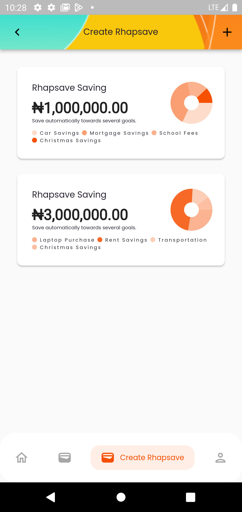
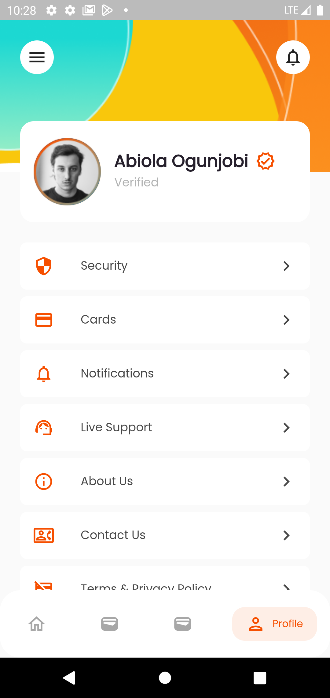
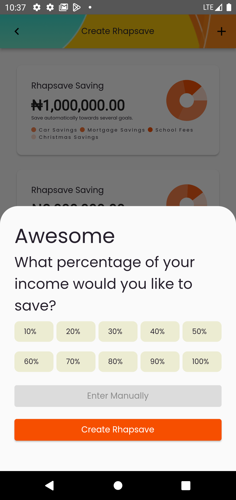
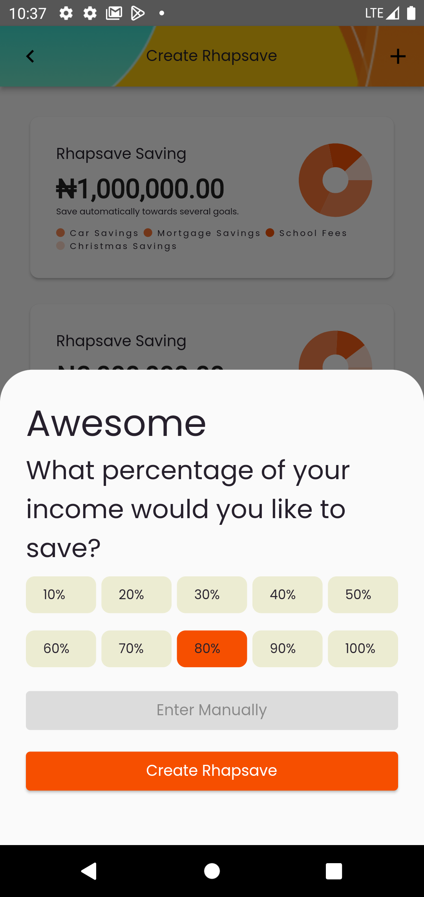

# Rhapsave

Rhapsave is a modern and intuitive Flutter application designed to help users manage their savings and track financial goals. The app features a clean, minimalist UI that makes financial tracking both easy and visually appealing.

## Features

- 📊 Beautiful and interactive charts for visualizing savings progress
- 💰 Track multiple savings goals
- 🎨 Modern and clean user interface
- 📱 Responsive design that works across different screen sizes
- 🌈 Custom theme with carefully crafted color schemes

## Tech Stack

- Flutter SDK (>=2.18.1 <3.0.0)
- Material Design
- Key Dependencies:
  - `google_fonts: ^3.0.1` - For beautiful typography
  - `boxy: ^2.0.6+2` - Advanced layout capabilities
  - `flutter_provider: ^2.1.0` - State management
  - `flutter_svg: ^1.1.5` - SVG rendering support
  - `fl_chart: ^0.55.1` - Interactive and animated charts
  - `intl: ^0.17.0` - Internationalization and formatting

## Getting Started

### Prerequisites

- Flutter SDK (>=2.18.1)
- Dart SDK
- Android Studio / VS Code with Flutter extensions

### Installation

1. Clone the repository:
   ```bash
   git clone https://github.com/yourusername/rhapsave.git
   ```

2. Navigate to the project directory:
   ```bash
   cd rhapsave
   ```

3. Install dependencies:
   ```bash
   flutter pub get
   ```

4. Run the app:
   ```bash
   flutter run
   ```

## Screenshots

| Home Screen | Savings Overview | Detailed View | Statistics |
|------------|------------------|---------------|------------|
|  |  |  |  |

## Project Structure

```
lib/
├── data/           # Data layer (models, repositories)
├── presentation/   # UI layer
│   ├── core/       # Core UI components (routes, theme, strings)
│   ├── screens/    # App screens
│   └── widgets/    # Reusable widgets
└── main.dart       # Entry point
```

## Contributing

Contributions are welcome! Please feel free to submit a Pull Request.

## License

This project is licensed under the MIT License - see the [LICENSE](LICENSE) file for details.
